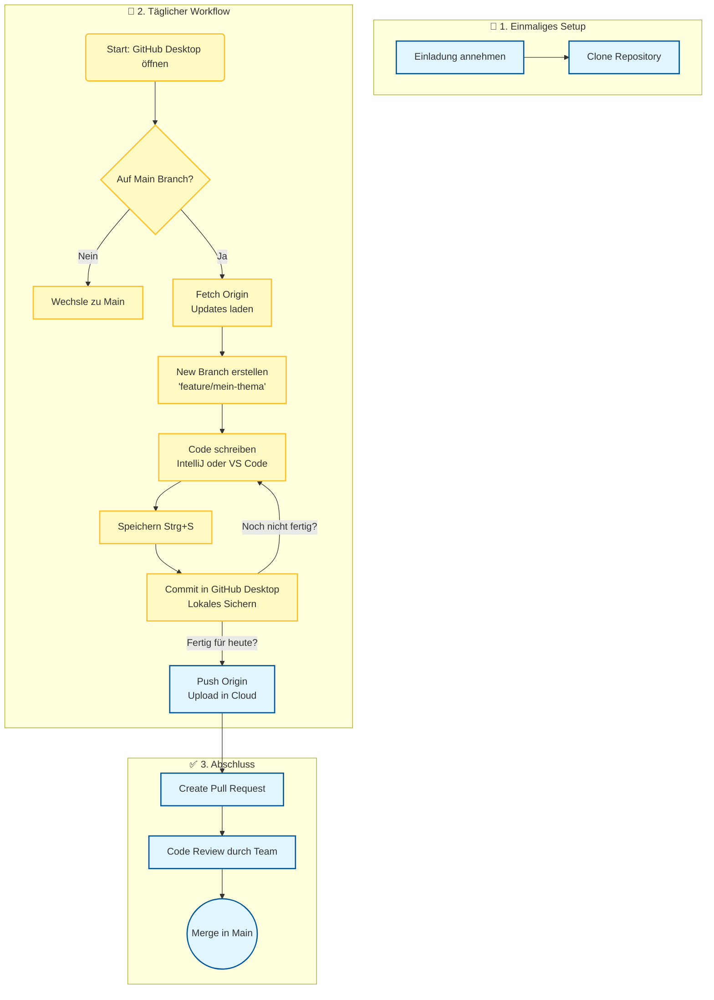

# ai4mbse-valido
Dieses Repository bildet die Systemarchitektur des Projektes AI4MBSE ab.

# Unser Projekt Workflow

Hier ist der Ablauf für unser Team:

```mermaid
graph TD
    %% Styling definitions
    classDef remote fill:#e1f5fe,stroke:#01579b,stroke-width:2px;
    classDef local fill:#fff9c4,stroke:#fbc02d,stroke-width:2px;
    classDef action fill:#e8f5e9,stroke:#2e7d32,stroke-width:2px;

    subgraph SETUP ["🏁 1. Einmaliges Setup"]
        A[Einladung annehmen] --> B[Clone Repository]
    end

    subgraph DAILY ["🔄 2. Täglicher Workflow"]
        C(Start: GitHub Desktop öffnen) --> D{Auf Main Branch?}
        D -- Nein --> E[Wechsle zu Main]
        D -- Ja --> F[Fetch Origin<br/>Updates laden]
        F --> G[New Branch erstellen<br/>'feature/mein-thema']
        
        G --> H[Code schreiben <br/> IntelliJ oder VS Code]
        H --> I[Speichern Strg+S]
        I --> J[Commit in GitHub Desktop<br/>Lokales Sichern]
        
        J -- Noch nicht fertig? --> H
        J -- Fertig für heute? --> K[Push Origin<br/>Upload in Cloud]
    end

    subgraph FINISH ["✅ 3. Abschluss"]
        K --> L[Create Pull Request]
        L --> M[Code Review durch Team]
        M --> N((Merge in Main))
    end

    %% Apply styles
    class A,B,K,L,M,N remote;
    class C,D,E,F,G,H,I,J local;
```
