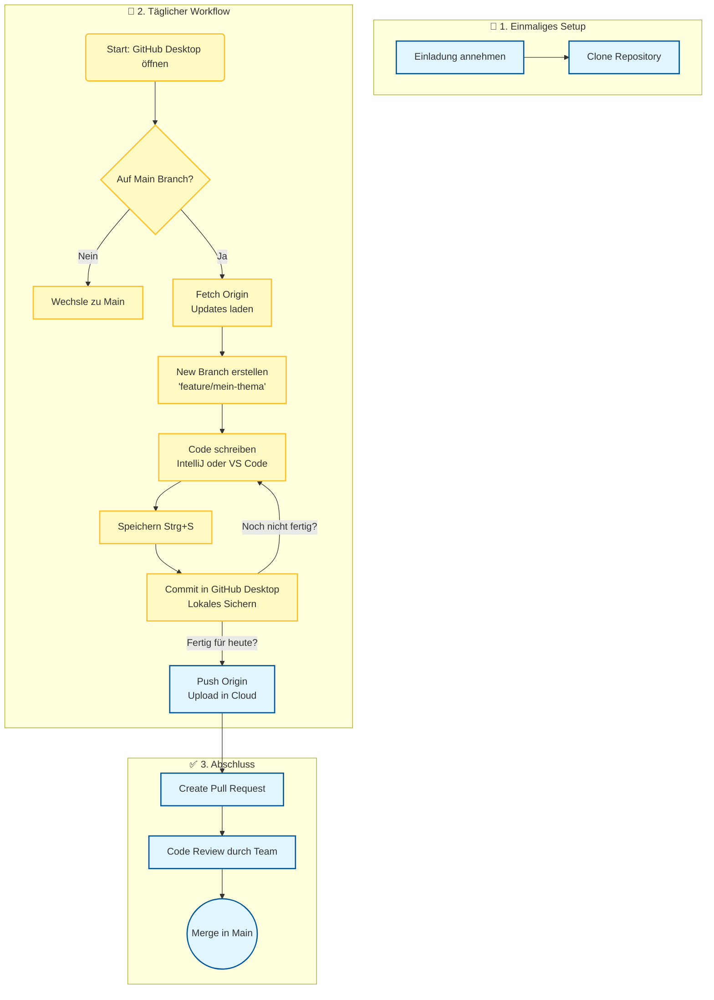

# ai4mbse-valido
Dieses Repository bildet die Systemarchitektur des Projektes AI4MBSE ab.

# 🚀 AI4MBSE Plugin - Development Masterplan & Architecture Guide

Willkommen im Entwickler-Team! Wir bauen ein **AI-gestütztes Review-System** für Cameo Systems Modeler.

Damit wir zu fünft parallel arbeiten können, ohne uns gegenseitig zu blockieren, folgen wir strikt dem **Interface-Driven Design**.

---

## 🏗️ Die Architektur (Unsere Landkarte)

Wir trennen **Verträge** (Interfaces) strikt von der **Umsetzung** (Modules).

### Ordnerstruktur (`src/main/java/com/hm/ai4mbse/plugin/`)

| Ordner | Zugriffsrecht | Beschreibung |
| :--- | :--- | :--- |
| 🔒 **`interfaces/`** | **READ-ONLY** | Hier liegen die Verträge (`IReviewService`, `IModelAccess`). **Änderungen nur durch Dominik!** |
| 📦 **`model/`** | **READ-ONLY** | Hier liegen die Datenpakete (`ReviewIssue`), die zwischen den Modulen fließen. Keine Logik! |
| 🧠 **`core/`** | **Simon** | Hier startet das Plugin (`PluginLifecycle`) und der `Orchestrator` steckt die Module zusammen. |
| 🛠️ **`modules/`** | **TEAM** | Hier arbeitet ihr! Jedes Modul ist eine "Black Box". |
| ├── `ui/` | **Moritz** | Benutzeroberfläche (Swing/JDialog). |
| ├── `database/` | **Moritz** | Speichern/Laden von Regeln (JSON). |
| ├── `catiamsosa/` | **Marius** | Zugriff auf MagicDraw Open API. |
| ├── `ai/` | **Michi** | Kommunikation mit Google Gemini (HTTP). |
| ├── `rules/` | **Michi** | Logik zur Regel-Generierung (BrainDump -> Prompt). |
| └── `review/` | **Michi** | **Die eigentliche Prüfung (Modell + Regel = Ergebnis).** |

---

## 📜 Die 3 Goldenen Regeln

Wer diese Regeln bricht, bricht den Build!

### 1. Programmiere IMMER gegen Interfaces 🔌
Du darfst niemals eine Klasse aus einem fremden Modul importieren.
* ❌ **FALSCH:** `import com.hm.ai4mbse.plugin.modules.ai.GeminiService;`
* ✅ **RICHTIG:** `import com.hm.ai4mbse.plugin.interfaces.IAIService;`

### 2. Keine `new`-Instanziierung von Services 🚫
Erstelle Dienste nicht selbst. Lass sie dir geben (Dependency Injection).
* ❌ **FALSCH:** `IReviewService service = new GeminiService();` (im UI-Code)
* ✅ **RICHTIG:** `public ReviewDashboard(IReviewService service) { ... }`

### 3. Daten gehören in `model/` ✉️
Wenn du Daten (z.B. ein Review-Ergebnis) an ein anderes Modul übergibst, nutze **nur** Klassen aus dem `model`-Ordner. Definiere keine eigenen Datentypen in deinem Modul, die andere nutzen sollen.

---

## 👥 Rollen & Arbeitsaufträge

### 👑 Dominik (Architekt & Lead)
* **Verantwortung:** Hüter der Schnittstellen und Infrastruktur.
* **Status:** Das Repository-Skelett steht. `plugin.xml` und `build-jar.ps1` sind konfiguriert.
* **To-Do:**
    * Pull Requests (PRs) der anderen reviewen: Halten sie sich an die Interfaces?
    * Wenn jemand eine Interface-Änderung braucht, setzt du sie um.

### 🎬 Simon (Orchestrator)
* **Verantwortung:** Bringt alles zum Laufen (`core/`).
* **Arbeitsbereich:** `src/main/java/com/hm/ai4mbse/plugin/core/Orchestrator.java`
* **To-Do:**
    * Entferne die `// TODO` Kommentare, sobald Michi und Moritz ihre Klassen committet haben.
    * Instanziiere die Module: `IAIService ai = new GeminiService(...)`.
    * Verbinde sie: `new ReviewDashboard(..., ai)`.
    * Registriere die Action im MagicDraw-Menü.

### 🎨 Moritz (UI & Database)
* **Verantwortung:** Was der Nutzer sieht & wo Regeln gespeichert werden.
* **Arbeitsbereich:** `modules/ui/` und `modules/database/`.
* **To-Do:**
    * **UI:** Implementiere `ReviewDashboard.java` als `JDialog`. Nutze `IReviewService` für den Klick auf "Start Review".
    * **DB:** Implementiere `JsonDatabase.java`, das `IDatabase` erfüllt (Speichern von JSON auf Festplatte).
    * **Tipp:** Nutze für das UI den `MockReviewService`, solange Michi noch am "echten" Service baut.

### 🧠 Michi (AI, Rules & Review)
* **Verantwortung:** Die Intelligenz des Systems.
* **Arbeitsbereich:** `modules/ai/`, `modules/rules/` und **`modules/review/`**.
* **To-Do:**
    1.  **AI:** `GeminiService.java` steht schon (Gemini 3 Pro, Zero-Dependency). Teste es mit einem echten API-Key!
    2.  **Rules:** Implementiere `RuleGenerator` in `modules/rules/`. Dieser wandelt User-Input (BrainDump) in einen System-Prompt um (`IRuleGenerator`).
    3.  **Review (KERNSTÜCK):** Implementiere `ReviewExecutionService` in `modules/review/`.
        * Diese Klasse implementiert **`IReviewService`**.
        * Sie steuert den Ablauf: 1. Daten von Marius holen -> 2. Prompt aus DB holen -> 3. An KI senden -> 4. Ergebnis als `ReviewIssue` zurückgeben.

### 🔌 Marius (Cameo / ModelAccess)
* **Verantwortung:** Der Datenlieferant aus MagicDraw.
* **Arbeitsbereich:** `modules/catiamsosa/`.
* **To-Do:**
    * Implementiere `ModelAccess.java`, das `IModelAccess` erfüllt.
    * Hole das selektierte Element (`Application.getInstance()...`).
    * Extrahiere die relevanten Daten (Name, Doku, Beziehungen) für den Prompt.
    * **Wichtig:** Achte darauf, nicht das *ganze* Modell zu laden, sondern nur den Scope!

---

## 🛠️ Workflow: Wie fange ich an?

Wähle das Werkzeug, mit dem du dich am wohlsten fühlst. **Am Ende führen alle Wege zum gleichen Ziel.**

### 🖥️ Option A: Git Bash (Der Profi-Weg)
Ideal für schnelles Arbeiten, wenn du die Befehle kennst.
1.  **Clone:** `git clone https://github.com/dbr-SE/ai4mbse-valido.git`
2.  **Branch:** `git checkout -b feature/mein-feature` (Erstelle deinen eigenen Arbeitsbereich).
3.  **Code:** Gehe in deinen Ordner unter `modules/` und lege los.
4.  **Push:**
    * `git add .`
    * `git commit -m "Mein Fortschritt"`
    * `git push -u origin feature/mein-feature`

### 🖱️ Option B: GitHub Desktop (Visuell & Einfach)
Perfekt, wenn du lieber klickst als tippst und eine Übersicht haben willst.
1.  **Clone:** Öffne GitHub Desktop -> Menü `File` -> `Clone repository...` -> URL `https://github.com/dbr-SE/ai4mbse-valido` eingeben -> `Clone`.
2.  **Branch:** Klicke oben in der Leiste auf **"Current Branch"** -> **"New Branch"** -> Gib deinen Namen ein (z.B. `feature/ui-moritz`) -> `Create Branch`.
3.  **Code:** Klicke auf den Button **"Show in Explorer"**, öffne die Dateien in deiner IDE (IntelliJ/VSCode/Eclipse) und arbeite ganz normal.
4.  **Commit & Push:**
    * Gehe zurück zu GitHub Desktop. Du siehst deine Änderungen links.
    * Gib unten links eine Zusammenfassung ein.
    * Klicke **"Commit to..."**.
    * Klicke oben rechts auf **"Push origin"** (oder "Publish branch").

### 🌐 Option C: GitHub Website (Für schnelle Fixes)
*Hinweis: Nur für Dokumentation oder kleine Textänderungen geeignet! Nicht für Java-Programmierung.*
1.  **Branch:** Klicke auf der Repo-Startseite oben links auf den Button **"main"**. Tippe einen neuen Namen ein und klicke **"Create branch..."**.
2.  **Edit:** Navigiere zur gewünschten Datei und klicke auf das **Stift-Icon** ✏️.
3.  **Upload:** Um fertige Dateien hochzuladen, gehe in den Ordner und klicke oben rechts auf **"Add file"** -> **"Upload files"**.
4.  **Commit:** Scrolle nach unten, gib eine Nachricht ein und klicke **"Commit changes"**.

---

## 🚨 Troubleshooting (Erste Hilfe)

* **MagicDraw lädt das Plugin nicht?**
    * Check `src/main/resources/plugin.xml`: Zeigt `class="..."` auf `com.hm.ai4mbse.plugin.core.PluginLifecycle`?
* **Build Fehler "Gson not found"?**
    * Wir nutzen **kein GSON** mehr! Nutze `GeminiService` mit der eingebauten String-Logik.
* **Fenster verschwindet hinter MagicDraw?**
    * Stelle sicher, dass du im UI `super(Application.getInstance().getMainFrame(), ...)` aufrufst.

**Viel Erfolg Team! Let's build this.** 🚀

# Unser Projekt Workflow (DRAFT)

Hier ist der Ablauf für unser Team:

